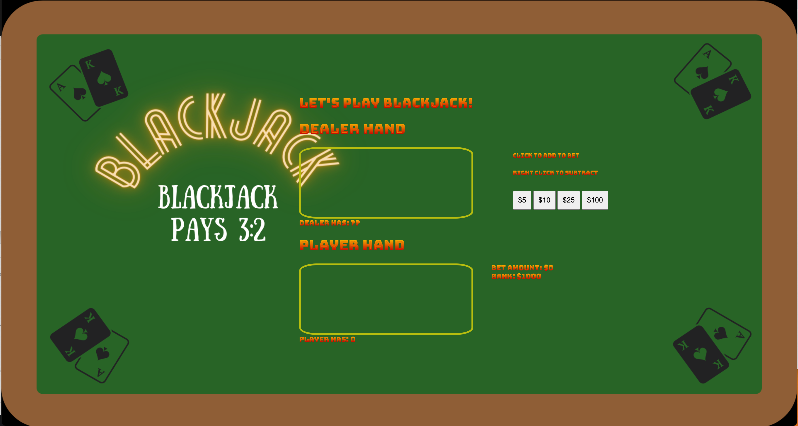
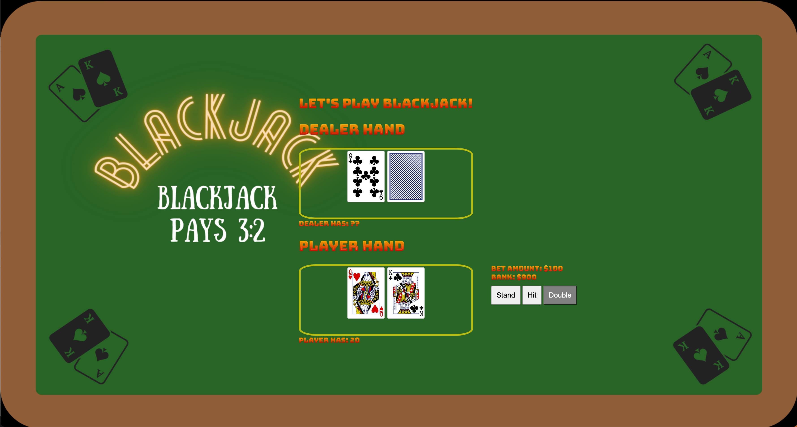

Title: Blackjack
AKA '21' is a card game between you and the dealer. The object of the game is to have your cards total closest or equal to 21 and have a higher total than the dealer without going over 21. Card values are indicated by the number on the card, face cards, such as a king or queen, have a value of 10, and aces have a value of 1 or 11. You win your bet (1:1) thus making 2x your bet. Blackjack is indicated by an ace and a facecard or a 10. Blackjack is paid out at 3:2 or 2.5x your bet. Once the cards are dealt you have options to Hit (take a card), Stand (not take anymore cards), or Double Down (take 1 card and double your bet). Next you will have busted (your cards total over 21) or the dealer will have a turn to hit or stand. The dealer must hit until their card values total at least 17. Whoever has the higher total without going over 21 wins the game.

Screenshots:
)

Technologies Used: HTML, CSS, JavaScript, Canva

Getting Started: https://sakibomby.github.io/Blackjack/
1) Place bets by clicking money buttons in increments of $5, $10, $25, or $100. Your initial Bank is $1000. You cannot bet more than what you have in your bank.
2) Press Deal button to deal the cards.
3) Click on Hit to take a card, Stand to not take anymore cards, Double to take 1 card and double your bet if you have that amount in your Bank.
4) If you loose all your money press Replay to start over.

Next Steps: 
1) card animations and sounds
2) mobile design
